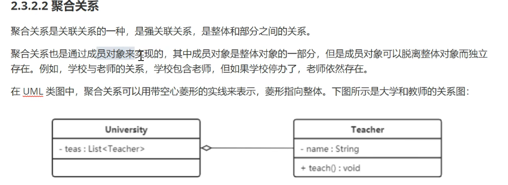

# java设计模式
## 设计模式分类
------------------------------------------------
- 创建型模式
用于描述“怎样创建对象”，他的主要特点是“将对象的创建与使用分离”GoF书中提供了单例，原型，工厂方法，抽象工厂，建造者5种创建者模式
- 结构性模式
  用于描述如何将类或对象按某种布局组成更大的结构，GoF书中提供了代理，适配器，桥接，装饰，外观，享元，组合等7种结构性模式
- 行为型模式
  用于描述类和对象之间怎样相互共同合作完成对某个对象无法单独完成的任务，以及怎样分配职责。GoF提供了模板方法，策略，命令，职责链，状态，观察者，中介者，迭代器，访问者，备忘录，解释器等11种方式。
  ## UML
- 类的表示方式
  
- 类与类之间的表示方式
  - 关联关系：
     单线关联：
     
     双向关联：
     
     自关联：
     
  - 聚合关系：
     
  - 组合关系
     
  - 依赖关系
        
  - 继承关系
          
  - 实现关系
     